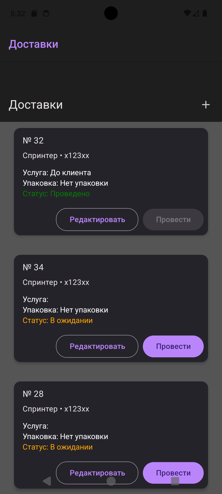

# delevery_task


## Getting Started <a name = "getting_started"></a>


```
git clone https://github.com/bulat-nitaliev/delivery_react_native.git
```

### Installing


```
cd delivery_react_native
yarn install 
yarn start
```





